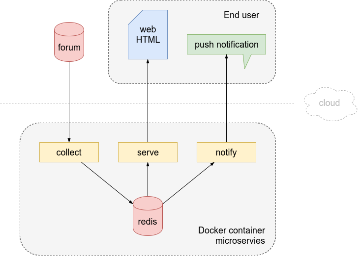

# UFA scraper

These are a collection of Ruby microservices for periodically scraping a forum classifieds section, collecting all new posts to a database and then serving that data as a custom formatted web page. A separate component sends push notifications to a mobile device when pre-defined keywords appear in a post.

## Technologies

- Nokogiri Ruby gem for scraping web pages
- Sinatra framework for serving the data
- Redis as backend post data storage
- pushjet.io for sending notifications to various mobile devices
- Docker containers for all components (Ruby microservices, database backend)
- Docker-compose orchestration for hosting the whole platform as a quickly deployable stack

## System architecture 



## System components

### 1. collect

This module is responsible for periodically downloading forum webpages and scraping them collecting all new posts and pushing those to redis DB.

Format of an entry (goes to redis as a hash):
```
    { id: id, sellstatus: sellstatus, text: text, link: link,
      img: imgurl, timestamp: timestamp.to_i, author: author,
      parsetime: Time.now.to_i }
```

### 2. serve

This module serves the data from redis DB as a custom formatted table based web page.
It listens on port 4567 of the serve container which can be published for outside access. By default docker-compose file is taking care of this.

It is possible to pass a filter parameter to the URL to be able to filter posts for a keyword. Usage example:
```
http://serveufaurl:4567/?filter=keyword
```

### 3. notify

This module periodically parses the last 2000 entries in the redis DB and looks for pre-defined keywords and sends a pushjet.io notification when a match is found. It keeps track of notifications already sent in redis to avoid duplicate alerts. 

Uses pushjet.io REST API to send push message. In order to use this module you have to create your notification channel on pushjet.io and put service secret in secret.txt before building the container.

Keywords go into keywords.txt one keyword in each line.

Alternatively you can provide these two files to the container through bind mounts.

### 4. redis

Box standard redis container with host bind mount data volume in append only format to keep track of all persistent data. You can modify the docker-compose.yml to use docker persistent volumes for redis storage if you prefer.

## Dockerfiles

This docker-compose.yml is used to bring the whole stack up.

```
version: "2"
services:
  collect:
    build: ./collect
    image: adamkov/ufacollect
    command: ruby collect.rb
    depends_on:
      - redis
    links:
      - redis
  serve:
    build: ./serve
    image: adamkov/ufaserve
    command: ruby serveufa.rb -o 0.0.0.0
    ports:
      - "4567:4567"
    depends_on:
      - redis
    links:
      - redis
  notify:
    build: ./notify
    image: adamkov/ufanotify
    command: ruby notify.rb
    depends_on:
      - redis
    links:
      - redis
  redis:
    container_name: redis
    image: redis:alpine
    command: redis-server --appendonly yes
    volumes:
      - ./redisdata:/data
```

Ruby application Dockerfile example:
```
FROM ruby:latest
MAINTAINER adamkov

RUN apt-get update -qq && \
    apt-get install -y build-essential libpq-dev

COPY Gemfile* /tmp/
WORKDIR /tmp
RUN bundle install

ENV app /app
RUN mkdir $app
WORKDIR $app
ADD . $app

USER nobody
CMD ruby collect.rb
```

## TODO

- Error handling (network outage, invalid format, scraping errors, redis disappearance, etc.)
- Automatic restart of docker containers on-failure
- Subcomponents shoud wait for some seconds on startup to avoid infinite loop of startup-fail

## Links, references

- [Parsing an HTML/XML Document using Nokogiri](http://www.nokogiri.org/tutorials/parsing_an_html_xml_document.html)
- [Sinatra webpage](http://sinatrarb.com/)
- [pushjet.io documentation & examples](http://docs.pushjet.io/)
- [Redis: Zero to Master in 30 minutes](http://openmymind.net/2011/11/8/Redis-Zero-To-Master-In-30-Minutes-Part-1/)
